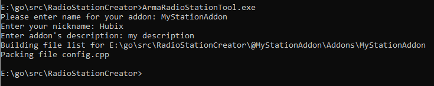

# ArmaRadioStationTool
This tool let's you easily add stations to Arma Radio mod

## How to use
1. In order to add a stations you will need to create a new .txt file inside of "stations" directory.
2. Name newly created file with name of the station you wish to add.
3. Paste station's url inside the .txt file
4. Every station must be a separate file
5. After adding all stations open ArmaRadioStationTool.exe and follow instructions on screen

## Credits
[gopbo](https://github.com/g0dsCookie/gopbo) - Package used to create .pbo files
